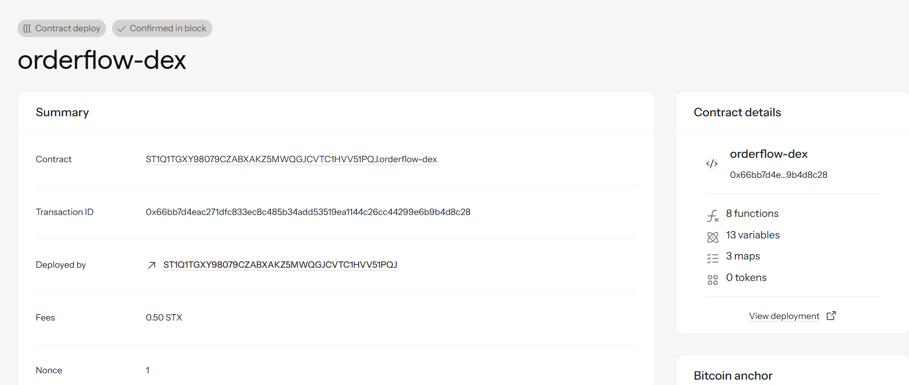

## OrderFlow DEX
 Professional Decentralized Exchange for Advanced Trading

## Project Description
OrderFlow DEX is a sophisticated decentralized exchange built on the Stacks blockchain using Clarity smart contracts. This professional trading platform provides advanced order types, limit orders, and algorithmic trading capabilities for institutional and retail traders.

The platform features a streamlined two-function core architecture:
- **Limit Order Placement**: Create professional buy/sell orders with precise price control
- **Trade Execution**: Advanced matching engine for executing trades with price improvement and fee calculation

Key features include:
- ✅ **Professional Limit Orders** with comprehensive validation
- ✅ **Advanced Trade Matching** with price improvement logic  
- ✅ **Real-time Order Book** management and tracking
- ✅ **Fee Calculation** and revenue distribution
- ✅ **Trade History** and analytics for transparency
- ✅ **Escrow System** for secure fund management during trading
- ✅ **Multi-token Support** for diverse trading pairs

## Project Vision
Our vision is to create the most advanced and user-friendly decentralized exchange on Bitcoin Layer 2, providing institutional-grade trading tools while maintaining the security and decentralization principles of the Stacks blockchain.


## Contract Address Details
Contract Identifier - ST1Q1TGXY98079CZABXAKZ5MWQGJCVTC1HVV51PQJ.orderflow-dex


## Quick Start

### Prerequisites
- Clarinet v3.0+
- Node.js 18+
- Stacks Wallet

### Installation
```bash
git clone <repository-url>
cd orderflow-dex
clarinet check
clarinet test
clarinet devnet start
```

### Usage
```clarity
;; Place a limit buy order
(contract-call? .orderflow-dex place-limit-order "buy" "STX-USDT" u1000000 u2500000)

;; Execute a trade between matching orders
(contract-call? .orderflow-dex execute-trade u1 u2 u500000)
```

## Documentation
- [Smart Contract API Reference](docs/api.md)
- [Trading Guide](docs/trading-guide.md)
- [Integration Tutorial](docs/integration.md)
- [Security Best Practices](docs/security.md)

## Community & Support
- **Website**: https://orderflow-dex.com
- **Documentation**: https://docs.orderflow-dex.com
- **Discord**: https://discord.gg/orderflow-dex
- **Twitter**: https://twitter.com/orderflow_dex
- **GitHub**: https://github.com/orderflow-dex


## Disclaimer
This is experimental DeFi software. Use at your own risk. Always audit smart contracts before mainnet deployment and never invest more than you can afford to lose.

---
